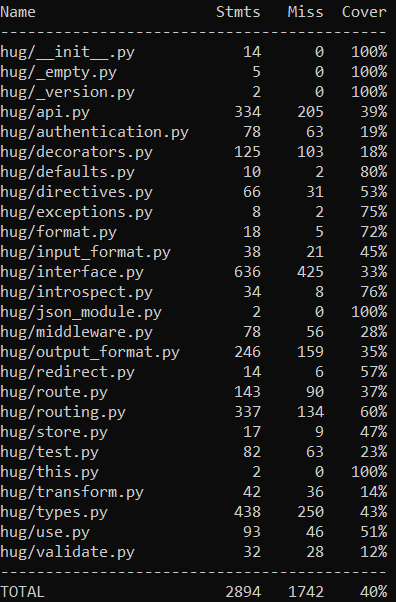

# Report for Assignment 1

## Project chosen

Name: Hug by Hug API

URL: https://github.com/hugapi/hug/

Number of lines of code and the tool used to count it: 10.8 KLOC - Lizzard

Programming language: Python

## Coverage measurement

### Existing tool

We ran coverage.py ; we tested it within the project root to see what functions needed to be improved and then selected 8 functions to make/enhance tests for.

### Your own coverage tool

### Individual tests

#### Marwan Amrhar,

---

- `Localrouter.__init__`

Before:

After:

---

- `Localrouter.directives`

Before:

After:

- Fixed a bug with the use of a deprecated function (numpy.unicode -> numpy.str\_);

#### Sajeed Bouziane,

---

- `Localrouter.validate`

Before:

After:

---

- `Localrouter.version`

Before:

After:

#### Ayoub Bouazza,

---

- `Localrouter.__call__`

Before:

After:

---

- `Router.__init__`

Before:

After:

#### Yahia Noeman,

---

- `API.__init__`

Before:

After:

---

- `ModuleSingleton.__call__`

Before:

After:

### Overall

---

This is the overall coverage after implementing our unittests:

As we can see the coverage of the files api.py, routing.py have been increased, these also contained the functions that we covered.

## Statement of individual contributions

First we all together did the lizzard count and overall coverage and figured out how to exactly make a unit test and experimented around with Localrouter since we discovered that this was barely/not tested.

Marwan Amrhar:

- Figured out a bug which didn't allow us to run the coverage;
- Figured out how to make unit tests in localrouter and made 2 unit tests in there.

Sajeed Bouziane

- Made 2 more unit tests in localrouter after working together with Marwan;
- Helped set-up the readme file.

Ayoub Bouazza:

- Made a final unit test in localrouter;
- Made a unit test for the initialization of the Router class.

Yahia Nouman

- Made a unit tests for the api.py file which covered the initialization of the api
- Made a unit test for the api.py file which covered singleton module call function.
